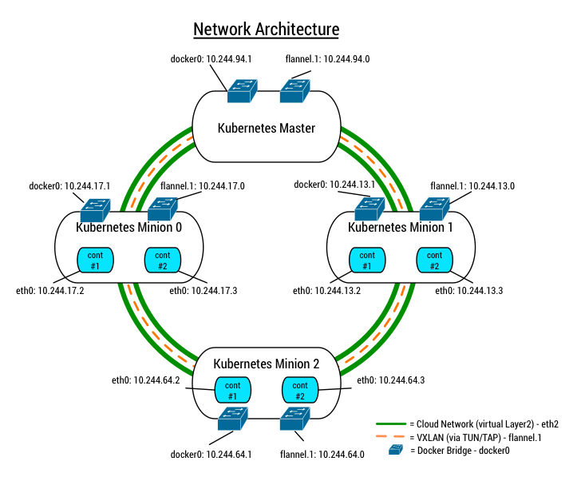

## Corekube
</p>

##### Last Major Update: 08/18/2016

#### [Latest Release](https://github.com/metral/corekube/releases/latest)

## TL;DR

Corekube is a Heat template for [OpenStack](https://www.openstack.org) that creates the necessary infrastructure as well as configures it accordingly to deploy and host a Kubernetes cluster.

The main pillars of Corekube's mission can be categorized into the following:

1. **Infrastructure** (a.k.a "infra") - Includes the creation, provisioning and installation of the underlying cloud infrastructure and tools required to setup a Kubernetes cluster. (This is the heat template itself)
2. **Discovery** - Utilizes Etcd to enable a private discovery service amongst the servers.
3. **Overlord** - The deployment logic that consumes the infrastructure created, as well as the cluster information coordinated by the 'Discovery' node, to deploy Kubernetes onto the servers.

#### Component Versions
**CoreOS** - OS running on all nodes

|      **Tool**      |                          **Version**                         |
|:--------------:|:--------------------------------------------------------:|
|     CoreOS     | [1010.5.0 (Stable)](https://coreos.com/releases/#1010.5.0) |
|     Docker     |                           1.10.3                          |
|  Etcd (Client) |                           0.4.9/2.3.1                    |
| Fleet (Client) |                           0.11.7                          |
|     Flannel*   |                           0.5.5                          |

*Note: Flannel is running on all Kubenetes Nodes(minions) only. It is not installed nor configured on neither the Discovery or Overlord.


**Kubernetes** - Management layer for containerized appliations

|    **Tool**    |                                      **Version**                                     |
|:----------:|:--------------------------------------------------------------------------------:|
| Kubernetes | [1.4.0](https://github.com/kubernetes/kubernetes/releases/tag/v1.4.0) |

**Overlord** - Deployment logic that stands up a Kubenetes cluster

|      **Tool**      | **Version** |
|:--------------:|:-------:|
|    Etcd API    |    v2   |
|    Fleet API   |    v1   |
| Kubernetes API |    v1   |

* For more detail, view its [conf.json](https://github.com/metral/overlord/blob/master/conf.json)

#### Quick Links
* [Overlord](https://github.com/metral/overlord) - _Deployment logic to stand up a Kubernetes cluster_
* [corekube_travis](https://github.com/metral/corekube_travis) - _TravisCI build & setup scripts for testing infrastructure & overlord tasks_
* [goheat](https://github.com/metral/goheat) - _Golang library to interact with OpenStack Heat_
* [goutils](https://github.com/metral/goutils) - _Golang library for common functionality_

#### Contributing
Please create all pull requests against the 'dev' branch. For stable versions, please go off of the releases >= v0.3.5

See [HACKING](https://github.com/metral/corekube/blob/master/HACKING.md) for
more information.

#### Original Blog Post (Sept. 10, 2014) _**Outdated**_

[Full Blog Post on Rackspace Developer Blog](https://developer.rackspace.com/blog/running-coreos-and-kubernetes/)

#### Corekube Deployment

```
heat stack-create corekube --template-file corekube-cloudservers.yaml -P keyname=<RAX_SSH_KEYNAME>
```

#### Using Kubernetes on the Corekube Deployment
[How to run examples on Kubernetes](#kubernetes-usage)

------------------

## Introduction
Corekube is an adapation of CoreOS's [Running Kubernetes Example on CoreOS](https://coreos.com/blog/running-kubernetes-example-on-CoreOS-part-2/) blog post from July 2014.

"Running Kubernetes Example on CoreOS" describes the installation of Kubernetes with VMWare, some manual network configuration & the deployment of the Kubernetes master & minion stacks via cloud-config.

Corekube has a heavy foundation on the CoreOS post, but with a couple of modifications:

* It uses Openstack (Rackspace Orchestration/Heat, Cloud Networks and Cloud Servers) & CoreOS's cloud-config to allow for:
    * Deployment of virtual resources required by both CoreOS and Kubernetes via OpenStack on the Rackspace Public Cloud
    * Creation of a repeatable template to instantiate, setup & bootstrap a proof-of-concept of a Kubernetes cluster running atop of CoreOS
* It also uses etcd & fleet API's to instantiate a Kubernetes role on a CoreOS machine
    * Utilizing the API's not only allows for the dynamic bootstrapping of CoreOS machines to assume a Kubernetes role, but creates the opportunity for expansion of the cluster in the future - abilities that are out of the scope of an all cloud-config based setup such as the one demonstrated in the CoreOS post
        * This would only require to point new machines to the etcd discovery node and then use our same mechanisms to provision it - more on this below

## Setup & Installation

**Heat Template**

At the helm of CoreKube is an OpenStack Heat template that lays down the
following infastructure in an ordered fashion, with discovery & priv_network
being built first, and then kubernetes-master-x, kubernetnes-minion-y and overlord
afterwords.

* "discovery" - CoreOS Cloud Server - Private etcd container used for cluster discovery
* "priv_network" - Cloud Network - Isolated layer 2 network used to connect the Kubernetes nodes
* "kubernetes-master-x" - CoreOS Cloud Server - Assumes the Kubernetes Master role
* "kubernetes-minion-y" - CoreOS Cloud Server - Assumes the Kubernetes Minion role
* "overlord" - CoreOS Cloud Server - Gathers cluster information from the 'discovery' node & provisions Kubernetes roles onto the Kuberenetes-\* host machines

**Discovery**

The first step in Corekube's process, after server instantiation, is to create a private discovery node using etcd in a Docker container. This private instance of etcd is used for service coordination/discovery and is eventually used by the Overlord to know what machines are in the cluster and then to deploy the kubernetes stacks onto the master and minion nodes.

The discovery service is provided by the [coreos/etcd](https://quay.io/repository/coreos/etcd)
Docker repo with a unique cluster UUID generated at creation via Heat. This is no different than CoreOS's [https://discovery.etcd.io](https://discovery.etcd.io) service as described in [CoreOS's Cluster Discovery](https://coreos.com/docs/cluster-management/setup/cluster-discovery/) post, other than the fact that it is private to this deployment.

This discovery node's IP, combined with the cluster UUID, are used to assemble the complete discovery path needed by the etcd & fleet client services running by default on the rest of the infrastructure, as these binaries come with CoreOS.

Therefore, when the rest of the cluster connects to the discovery path of our private discovery node, the Overlord will then have the information necessary to deploy the Kubernetes role stack onto the designated machine.

<p align="center"></p>

**Networking**

Once each CoreOS machine has booted & connected their etcd client to the private discovery node, a network architecture must be established for the containers. Kubernetes requires that each master/minion node have their own subnet to be used for the containers it manages. We will therefore setup a CIDR in which all Kubernetes hosts will co-exist on, have their own subnet in said CIDR, and this network will be overlayed onto the Rackspace Cloud Network ("priv_network") that we created earlier for isolated communication.

In order to understand the proposed networking architecture described, we must first understand at a high-level how networking works with regards to Docker:

* By default, Docker creates a virtual interface, specifically a virtual Ethernet bridge (aka a linux bridge), named docker0 on the host machine
* If docker0 does not have an address and subnet, which by default it does not, Docker randomly chooses an address and subnet from the private range defined by RFC 1918 that are not in use on the host machine, and assigns it to docker0.
* Because docker0 is a linux bridge, it automatically forwards packets between any other network interfaces that are attached to it
* So, every time Docker creates a container, it creates a pair of “peer” interfaces, specifically a virtual ethernet device (aka a veth device) which operate like opposite ends of a pipe - this lets containers communicate both with the host machine and with each other.

Now that we know how containers on Docker talk to other containers on the same host, we need to figure out how to allow containers on *different* hosts to have the same capability; specifically, when using a Rackspace Cloud Network, as it provides the servers an additional & isolated Layer 2 network.

To allow the containers to communicate with each other via its Kubernetes host machine (which has an interface on the isolated layer 2 network after we create it), there must be some sort of networking mechanism to allow for it.

However, its worth noting that on a Rackspace Cloud Network, MAC filtering is performed and cannot be disabled; therefore, any traffic that originates on the docker0 linux bridge by the container will *not* be able to inherently communicate with the rest of the docker0 linux bridges in the rest of the cluster.

Fortunately, there is a solution that helps us in various ways: establish a multicast [vxlan overlay](http://en.wikipedia.org/wiki/Virtual_Extensible_LAN) on top of the Cloud Network.

Since vxlan's function by encapsulating the MAC-based layer 2 ethernet frames within layer 4 UDP packets, and because we can create one to operate on multicast mode, we can accomplish a couple of key steps in terms of reaching our proposed network architecture:

* We get around the MAC filtering that the Cloud Network imposes, as vxlan traffic will still originate from the Cloud Network MAC address, and not the linux bridge used by Docker when a container creates the traffic
* Communication paths for the entire group of all Kubernetes host machines & containers becomes automatically established because multicast allows all machines (both hosts & containers) to not only send packets, but also, receive all packets sent on the overlay network; therefore, both Kubernetes host machines and containers can communicate with one another on their own subnet.

Luckily, there are a few network fabric projects set to resolve this exact issue in the Docker ecosystem that we could use. The top options are: [Zettio's Weave](http://zettio.github.io/weave/) and [CoreOS' Flannel](https://github.com/coreos/flannel).

For our network architecture we chose Flannel.

Below are the steps taken to create the proposed network architecture using Flannel. They configure the networking via cloud-config & systemd units:

* Each Kubernetes machine will have an interface, named "eth2", on the isolated L2 192.168.3.0/24 Rackspace Cloud Network
* Flannel then creates a TUN/TAP device named "flannel.1" that overlays onto the eth2 device
* Flannel also chooses a random subnet ID from the CIDR 10.244.0.0/15 that we've designated for the Flannel configuration and an MTU and assigns it to flannel.1
    * i.e 10.244.94.0/15
* Flannel then requests a subnet lease on 10.244.0.0/15 for the Docker bridge
* We then update the Docker bridge interface's host CIDR by assigning it the new subnet chosen by Flannel (relevant to the overlay CIDR), and drop both the Docker bridge CIDR and flannel.1's MTU into /run/flannel/subnet.env so that we can make the Docker daemon aware of the new configuration
    * i.e. $ cat /run/flannel/subnet.env
        * FLANNEL_SUBNET=10.244.94.1/24
        * FLANNEL_MTU=1450
* Docker is then restarted to take into account the new Docker bridge host CIDR & the flannel.1 MTU
* The Docker bridge is now set to instantiate containers on the new CIDR and depends on the host routing table to route all overlay traffic on the 10.244.0.0/15 CIDR via flannel.1

<p align="center"></p>

**Note**: If you have RackConnect v2 enabled you will require rules like the ones
below.  If you don't know what RackConnect is, you may safely ignore this.

* Dedicated -> Cloud Source=Network [192.168.3.0/24] Destination Type [All] Protocol [All]
* Dedicated -> Cloud Source=Network [10.244.0.0/15] Destination Type [All] Protocol [All]

**Note**: If you have RackConnect v3 enabled you must use the corekube-heat-rackconnectv3.yaml file and specify you RackConnect network id by setting the parameter rackconnect-network

**Overlord**

As you may have noticed in the "Cluster Discovery" figure above, there is an additional CoreOS server in addendum to the Kubernetes machines: the Overlord.

The Overlord is a custom [Go](http://golang.org/) package that operates in a Docker container.

After it joins the private discovery service, it is tasked with the following responsibilities in a daemon-like mode:

* Using the local etcd client API, watch for machines in the cluster to join the private discovery service & collect their relevant information & metadata
* Create systemd unit files for the Kubernetes master & minion machines from pre-existing templates
    * These templates are populated with relevant information collected locally
* Using the local fleet client API, start the batch of templates that deal with downloading the Kubernetes master/minion binaries to the respective CoreOS host
* Using the local fleet client API, start the batch of templates that deal with instantiating & running the Kubernetes master/minion binaries on the respective CoreOS host
* In the etcd datastore, mark the machine as being deployed. This aids with not redeploying a stack onto an already operational machine as it constantly watches for machines joining the private discovery node (new & old), as well as makes the Overlord partially tolerant. Specifically, if the Overlord were to crash/exit and assuming the private discovery service remains available, upon reinstation of the Overlord container, it will have a state of the machines already and use that to make deployment decisions.

The Overlord's tasks are best described in the following figure with a daemon-like looping manner:

<p align="center"></p>

<a name="overlord-tasks"></a>
To view the Overlord's progress and status, log into the the "overlord" server and examine the Docker container, it operates: "setup\_kubernetes"

```
$ ssh root@<overlord_ip>
```

**Note**: Building the setup\_kubernetes container and running it can take
several minutes, so refresh the following commands below until its output
resembles yours.

Review the Docker image pulled:

```
$ docker images

REPOSITORY          TAG                 IMAGE ID            CREATED             VIRTUAL SIZE
overlord            master              a3a95c2e3b1c        6 hours ago         604.9 MB
google/golang       1.4                 e0d9d5bb3d3d        5 days ago          559.6 MB
```

Review all Docker processes:

```
$ docker ps -a

CONTAINER ID        IMAGE                     COMMAND                CREATED
14678dc12d55        overlord:latest           /gopath/bin/overlord   6 hours ago
```

Review the logs of the overlord's container:

```
$ docker logs 14678dc12d55

2015/04/29 22:35:25 ------------------------------------------------------------
2015/04/29 22:35:25 Current # of machines seen/deployed to: (0)
2015/04/29 22:35:25 ------------------------------------------------------------
2015/04/29 22:35:25 Current # of machines discovered: (4)
2015/04/29 22:35:25 ------------------------------------------------------------
2015/04/29 22:35:25 Found machine:
2015/04/29 22:35:25 -- ID: 15af742f87f94806979e82a474b41e91
2015/04/29 22:35:25 -- IP: 10.208.4.90
2015/04/29 22:35:25 -- Metadata: (kubernetes_role => master)
2015/04/29 22:35:25 Created all unit files for: 15af742f87f94806979e82a474b41e91
2015/04/29 22:35:25 Starting unit file: master-download-kubernetes@15af742f87f94806979e82a474b41e91.service
2015/04/29 22:35:27 -- Waiting for the following unit file to complete: master-download-kubernetes@15af742f87f94806979e82a474b41e91.service
2015/04/29 22:35:28 -- Waiting for the following unit file to complete: master-download-kubernetes@15af742f87f94806979e82a474b41e91.service
2015/04/29 22:35:29 -- Waiting for the following unit file to complete: master-download-kubernetes@15af742f87f94806979e82a474b41e91.service
2015/04/29 22:35:42 The following unit file has completed: master-download-kubernetes@15af742f87f94806979e82a474b41e91.service
2015/04/29 22:35:42 Starting unit file: master-apiserver@15af742f87f94806979e82a474b41e91.service
2015/04/29 22:35:44 -- Waiting for the following unit file to complete: master-apiserver@15af742f87f94806979e82a474b41e91.service
2015/04/29 22:35:45 The following unit file has completed: master-apiserver@15af742f87f94806979e82a474b41e91.service
2015/04/29 22:35:45 Starting unit file: master-controller-manager@15af742f87f94806979e82a474b41e91.service
2015/04/29 22:35:47 -- Waiting for the following unit file to complete: master-controller-manager@15af742f87f94806979e82a474b41e91.service
2015/04/29 22:35:48 The following unit file has completed: master-controller-manager@15af742f87f94806979e82a474b41e91.service
2015/04/29 22:35:48 Starting unit file: master-scheduler@15af742f87f94806979e82a474b41e91.service
2015/04/29 22:35:50 -- Waiting for the following unit file to complete: master-scheduler@15af742f87f94806979e82a474b41e91.service
2015/04/29 22:35:51 The following unit file has completed: master-scheduler@15af742f87f94806979e82a474b41e91.service
2015/04/29 22:35:53 ------------------------------------------------------------
2015/04/29 22:35:53 Current # of machines seen/deployed to: (1)
2015/04/29 22:35:53 ------------------------------------------------------------
2015/04/29 22:35:53 Current # of machines discovered: (4)
2015/04/29 22:35:53 ------------------------------------------------------------
2015/04/29 22:35:53 Found machine:
2015/04/29 22:35:53 -- ID: 982129fef26b4790ba64b405b2602c14
2015/04/29 22:35:53 -- IP: 10.208.4.104
2015/04/29 22:35:53 -- Metadata: (kubernetes_role => minion)
2015/04/29 22:35:53 Created all unit files for: 982129fef26b4790ba64b405b2602c14
2015/04/29 22:35:53 Starting unit file: minion-download-kubernetes@982129fef26b4790ba64b405b2602c14.service
2015/04/29 22:35:55 -- Waiting for the following unit file to complete: minion-download-kubernetes@982129fef26b4790ba64b405b2602c14.service
2015/04/29 22:36:00 -- Waiting for the following unit file to complete: minion-download-kubernetes@982129fef26b4790ba64b405b2602c14.service
2015/04/29 22:36:01 The following unit file has completed: minion-download-kubernetes@982129fef26b4790ba64b405b2602c14.service
2015/04/29 22:36:01 Starting unit file: minion-kubelet@982129fef26b4790ba64b405b2602c14.service
2015/04/29 22:36:03 -- Waiting for the following unit file to complete: minion-kubelet@982129fef26b4790ba64b405b2602c14.service
2015/04/29 22:36:04 The following unit file has completed: minion-kubelet@982129fef26b4790ba64b405b2602c14.service
2015/04/29 22:36:04 Starting unit file: minion-proxy@982129fef26b4790ba64b405b2602c14.service
2015/04/29 22:36:06 -- Waiting for the following unit file to complete: minion-proxy@982129fef26b4790ba64b405b2602c14.service
2015/04/29 22:36:07 The following unit file has completed: minion-proxy@982129fef26b4790ba64b405b2602c14.service
2015/04/29 22:36:07 Registered node with the Kubernetes master: 10.208.4.104
2015/04/29 22:36:08 ------------------------------------------------------------
2015/04/29 22:36:08 Found machine:
2015/04/29 22:36:08 -- ID: 77e4d44ab2204fb0892aa7beccdff88f
2015/04/29 22:36:08 -- IP: 10.208.4.92
2015/04/29 22:36:08 -- Metadata: (kubernetes_role => minion)
2015/04/29 22:36:08 Created all unit files for: 77e4d44ab2204fb0892aa7beccdff88f
2015/04/29 22:36:08 Starting unit file: minion-download-kubernetes@77e4d44ab2204fb0892aa7beccdff88f.service
2015/04/29 22:36:10 -- Waiting for the following unit file to complete: minion-download-kubernetes@77e4d44ab2204fb0892aa7beccdff88f.service
2015/04/29 22:36:11 -- Waiting for the following unit file to complete: minion-download-kubernetes@77e4d44ab2204fb0892aa7beccdff88f.service
2015/04/29 22:36:12 The following unit file has completed: minion-download-kubernetes@77e4d44ab2204fb0892aa7beccdff88f.service
2015/04/29 22:36:12 Starting unit file: minion-kubelet@77e4d44ab2204fb0892aa7beccdff88f.service
2015/04/29 22:36:14 -- Waiting for the following unit file to complete: minion-kubelet@77e4d44ab2204fb0892aa7beccdff88f.service
2015/04/29 22:36:15 The following unit file has completed: minion-kubelet@77e4d44ab2204fb0892aa7beccdff88f.service
2015/04/29 22:36:15 Starting unit file: minion-proxy@77e4d44ab2204fb0892aa7beccdff88f.service
2015/04/29 22:36:17 -- Waiting for the following unit file to complete: minion-proxy@77e4d44ab2204fb0892aa7beccdff88f.service
2015/04/29 22:36:18 The following unit file has completed: minion-proxy@77e4d44ab2204fb0892aa7beccdff88f.service
2015/04/29 22:36:18 Registered node with the Kubernetes master: 10.208.4.92
2015/04/29 22:36:19 ------------------------------------------------------------
2015/04/29 22:36:19 Found machine:
2015/04/29 22:36:19 -- ID: 29b66575a8da412c8236af2716e55382
2015/04/29 22:36:19 -- IP: 10.208.4.116
2015/04/29 22:36:19 -- Metadata: (kubernetes_role => minion)
2015/04/29 22:36:19 Created all unit files for: 29b66575a8da412c8236af2716e55382
2015/04/29 22:36:19 Starting unit file: minion-download-kubernetes@29b66575a8da412c8236af2716e55382.service
2015/04/29 22:36:21 -- Waiting for the following unit file to complete: minion-download-kubernetes@29b66575a8da412c8236af2716e55382.service
2015/04/29 22:36:22 -- Waiting for the following unit file to complete: minion-download-kubernetes@29b66575a8da412c8236af2716e55382.service
2015/04/29 22:36:23 The following unit file has completed: minion-download-kubernetes@29b66575a8da412c8236af2716e55382.service
2015/04/29 22:36:23 Starting unit file: minion-kubelet@29b66575a8da412c8236af2716e55382.service
2015/04/29 22:36:25 -- Waiting for the following unit file to complete: minion-kubelet@29b66575a8da412c8236af2716e55382.service
2015/04/29 22:36:26 -- Waiting for the following unit file to complete: minion-kubelet@29b66575a8da412c8236af2716e55382.service
2015/04/29 22:36:27 The following unit file has completed: minion-kubelet@29b66575a8da412c8236af2716e55382.service
2015/04/29 22:36:27 Starting unit file: minion-proxy@29b66575a8da412c8236af2716e55382.service
2015/04/29 22:36:29 -- Waiting for the following unit file to complete: minion-proxy@29b66575a8da412c8236af2716e55382.service
2015/04/29 22:36:30 -- Waiting for the following unit file to complete: minion-proxy@29b66575a8da412c8236af2716e55382.service
2015/04/29 22:36:31 The following unit file has completed: minion-proxy@29b66575a8da412c8236af2716e55382.service
2015/04/29 22:36:31 Registered node with the Kubernetes master: 10.208.4.116
2015/04/29 22:36:33 ------------------------------------------------------------
2015/04/29 22:36:33 Current # of machines seen/deployed to: (4)
2015/04/29 22:36:33 ------------------------------------------------------------
2015/04/29 22:36:33 Current # of machines discovered: (4)
2015/04/29 22:36:34 ------------------------------------------------------------
2015/04/29 22:36:34 Current # of machines seen/deployed to: (4)
2015/04/29 22:36:34 ------------------------------------------------------------

```

## Kubernetes Usage

Once the Heat template finishes instantiating the Heat template, the resources are booted & initiated, and we've [verified that the Overlord's setup\_kubernetes container ran & exited successfully](#overlord-tasks), we can begin using the [examples](https://github.com/GoogleCloudPlatform/kubernetes#where-to-go-next) available that showcase Kubernetes capabilities.

Follow this set of steps to get you started:

* SSH into the Kubernetes Master node as the 'root' user using your RAX SSH keypair

    ```
    $ ssh root@<master_ip>
    ```

* Run the [Guestbook example](https://github.com/GoogleCloudPlatform/kubernetes/blob/master/examples/guestbook/README.md) offered by Kubernetes (of which has been compiled
  into a shell script):

    ```
    $ curl -sKS -L https://raw.githubusercontent.com/metral/corekube/master/guestbook-example.sh | bash
    ```

* Monitor the status of the guestbook deployment until all are in the "Running"
  state:

    ```
    $ /opt/bin/kubectl --server=0.0.0.0:8080 get pods
    ```

* Once all the containers are running, hit the IP on the 10.244.xxx.yyy subnet
  for the frontend machine you wish to reach either in a browser or curl, i.e.:

    ```
    $ curl 10.244.22.2
    ```

**Note:**

* You can assume that your Kubernetes cluster is operational if you've gotten
  to this point, so disregard the setup cluster instructions (Step 0) in the Kubernetes
  examples
* After you complete the deployment of the guestbook, it could take a couple of minutes before the frontend nodes are accessible, so be patient.


## SkyDNS

SkyDNS has been integrated into Corekube and is automatically available &
accessible within the Kubernetes cluster. To see how it was configured, view
the [systemd unit file used to deploy it](https://github.com/metral/overlord/tree/master/examples) and for information on how to use it, please check out the [Kubernetes docs](https://github.com/kubernetes/kubernetes/tree/master/cluster/addons/dns)
